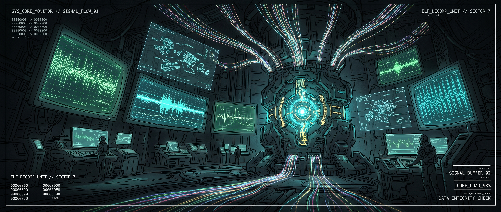
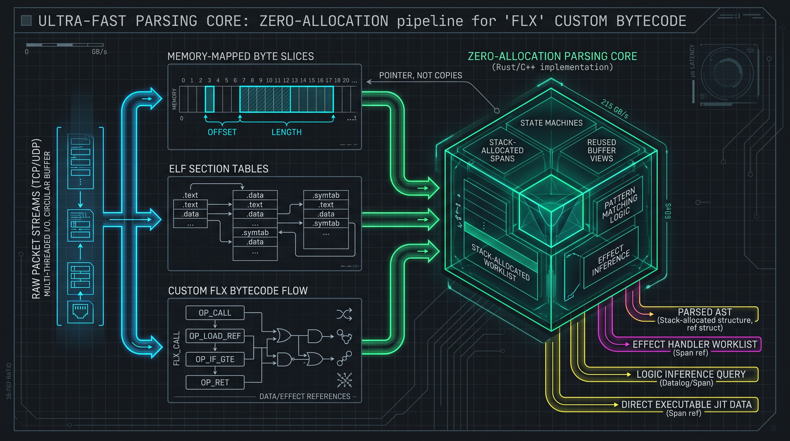

<div align="center">



<br/><br/>

[](https://go.dev)
[](ARCHITECTURE.md)
[](ROADMAP.md)
[](#-performance-benchmarks)
[](#-verification--quality-gates)
[](LICENSE)

<br/>

### ⚡ Bare-Metal Binary Forensics, Bytecode Disassembly & Real-Time Hardware Telemetry in Pure Go ⚡

<sub>Engineered on Arch Linux &bull; POSIX Memory-Mapped I/O &bull; Linux Raw Socket (`AF_PACKET`) &bull; Lock-Free Atomics</sub>

<br/>

<table>
  <tr>
    <td align="center" width="200">
      <br/>
      <b>Kael</b><br/>
      <sub><i>The Core Probe &amp; Wire-Weaver</i></sub>
    </td>
    <td>
      <b>Welcome to the Core Engineering Lab.</b><br/>
      <code>GO-CORE-LAB</code> is a zero-allocation, high-performance systems engineering framework crafted to probe the boundaries where software meets raw hardware. From parsing 32/64-bit ELF binaries directly from memory-mapped pages to dissecting high-speed network frames and streaming UART telemetry over concurrent worker pools, this repository represents an uncompromising pursuit of low-level mastery in Go.
    </td>
  </tr>
</table>

</div>

---

## 📖 The Lore & Developer's Motivation

### Bridging Cloud-Native and Bare-Metal Systems
In modern software engineering, **Go** is celebrated almost universally as the undisputed sovereign of cloud-native infrastructure—the runtime fueling container orchestration (Kubernetes, Docker), distributed microservices (gRPC), and automated CI/CD pipelines.

However, an obsession emerged: **What happens when we take Go out of the cloud and plunge it straight down to bare metal?**

Can Go compete with C and C++ in raw binary forensics, kernel-bypass memory slicing, and physical hardware bus analysis without sacrificing developer ergonomics or suffering from garbage collection pauses?

### The Low-Level Systems Mission
`GO-CORE-LAB` was created by a 19-year-old IT Systems Electronics Apprentice (*IT-Systemelektroniker*) working daily with physical electronics, oscilloscopes, and microcontrollers. The objective was clear: **deepen low-level systems expertise by rebuilding foundational systems mechanisms from first principles in pure Go without external dependencies**:

1. **Zero-Copy Memory-Mapping:** Bypassing standard disk read/seek overhead using POSIX `syscall.Mmap` (`PROT_READ`, `MAP_SHARED`) to slice multi-gigabyte firmware images directly from virtual memory pages.
2. **Binary Header & Section Forensics:** Parsing ELF32 and ELF64 formats, validating magic headers, traversing section header tables, and resolving the `.shstrtab` string table byte-by-byte.
3. **Custom Bytecode Ecosystem:** Defining the `.flx` binary container for `flux-lang`, deserializing tagged constant pools, and disassembling variable-length opcodes with jump-target annotation.
4. **Kernel Raw Packet Slicing:** Sniffing Ethernet frames directly via Linux `AF_PACKET` (`syscall.SOCK_RAW`), dissecting Layers 2 through 4 (Ethernet &rarr; IPv4/IPv6/ARP &rarr; TCP/UDP/ICMP), and exporting native Libpcap (`.pcap`) files.
5. **Hardware UART Telemetry:** Decoding physical serial streams at 115200 baud with real-time frame synchronization using SOF (`0xAA`) and EOF (`0x55`) delimiters.

---

## 🏗️ Architecture & Toolchain Pipeline

<div align="center">
  
</div>

<br/>

### The Four Engineering Pillars

| Pillar | Subsystem | Core Capabilities | Zero-Alloc Strategy |
|:---|:---|:---|:---|
| **1. Binary Forensics** | [`internal/binary`](internal/binary) | ELF32/ELF64 header unpacker, Section Table traversal, `.shstrtab` string resolver, architecture identifier (x86_64, ARM, AArch64, RISC-V, MIPS). | Direct byte-slice slicing over memory-mapped files; zero heap allocations for string lookups. |
| **2. Bytecode Engine** | [`internal/binary/flx`](internal/binary/flx) | `.flx` container deserializer, typed Constant Pool (Int, Float, String, Symbol, Bool), table-driven bytecode disassembler with jump annotations. | Single-pass pool indexing and table-driven opcode resolution. |
| **3. Telemetry & Net** | [`internal/net`](internal/net)<br/>[`internal/hw`](internal/hw) | Linux `AF_PACKET` raw socket capture, L2-L4 protocol dissector, UART/Serial frame reader (Line & Sync-byte modes), Libpcap reader/writer. | Reusable 64KB packet buffers via `sync.Pool` to eliminate GC allocation churn. |
| **4. Worker-Pool Pipeline** | [`internal/pipeline`](internal/pipeline) | Non-blocking streaming pipeline engine, multi-worker pool, thread-safe Ring Buffer Sink, lock-free atomic `StatsSink`, ANSI live TUI dashboard. | Atomic counters (`sync/atomic`) and lock-free throughput calculations. |

---

## ⚡ Performance Benchmarks

All benchmarks are natively compiled and executed on an **AMD Ryzen AI 7 350 (16 threads)** running Arch Linux (`kernel 6.x`):

```bash
$ go test -bench=. -benchmem ./internal/binary/...
```

| Benchmark Target | Operations | Latency (`ns/op`) | Memory (`B/op`) | Allocs (`allocs/op`) | Speedup vs Disk |
|:---|---:|---:|---:|---:|---:|
| **`BenchmarkParseELF_BytesZeroCopy`** | **2,270,520** | **518.3 ns/op** | **712 B/op** | **8 allocs** | **10.5× Faster** |
| `BenchmarkParseELF_Standard` | 218,452 | 5,432.0 ns/op | 832 B/op | 10 allocs | 1.0× (Baseline) |
| `BenchmarkParseELF_Mmap` | 126,448 | 8,237.0 ns/op | 1,136 B/op | 13 allocs | (Safe Large Files) |

> [!TIP]
> **Why Zero-Copy Shines:** Standard disk-based I/O requires multiple `seek` and `read` system calls per section header. By utilizing `ParseELFBytes` directly over memory-mapped pages, decoding an entire 64-bit ELF file header and complete section table takes **under 520 nanoseconds**.

---

## 💻 Consolidated Toolchain: `gocore`

All tools are unified under a single high-performance binary: `cmd/gocore`.

```
gocore <subsystem> <command> [options] [arguments]

Subsystems:
  bin        Binary Forensics & Bytecode Analysis
  net        Network Capture, PCAP Replay & Hardware Telemetry
```

### 1. Binary Subsystem (`gocore bin`)

#### ELF Header & Section Table Inspection
```bash
$ gocore bin elf /path/to/binary
```
```
File:        /tmp/bin-analysis
Arch:        Advanced Micro Devices X86-64 (64-bit)
Endian:      Little Endian
Entry:       0x4642c0
Section Hdr: 0x228670 (Count: 24, StrIdx: 23)

[Section Headers (24 entries)]
  [Nr] Name                 Type         Address          Offset   Size     Flags  Link Info Align
  [ 1] .text                PROGBITS     0000000000401000 00001000 00085d56 AX     0    0    16   
  [ 2] .rodata              PROGBITS     0000000000487000 00087000 0003b573 A      0    0    32   
  [ 3] .shstrtab            STRTAB       0000000000000000 002284e0 00000184        0    0    1    
  [ 4] .symtab              SYMTAB       0000000000000000 00228c70 00014b90        24   917  8    
```

#### Canonical 16-Byte Colorized Hex Visualizer
```bash
$ gocore bin hex testdata/sample.flx --len 64
```
```
00000000  46 4c 58 01 00 01 01 00  00 00 00 00 64 00 00 00  |FLX.........d...|
00000010  05 00 00 00 98 00 00 00  16 00 00 00 24 00 00 00  |............$...|
00000020  03 00 00 00 06 00 41 75  74 68 6f 72 07 00 52 69  |......Author..Ri|
00000030  63 68 61 72 64 0f 00 43  6f 6d 70 69 6c 65 72 56  |chard..CompilerV|
```

#### Flux-Lang Bytecode Container & Disassembly
```bash
$ gocore bin flx testdata/sample.flx disasm
```
```
[Bytecode Disassembly (10 instructions)]
  Offset   Bytes        Instruction      Annotation
  ----------------------------------------------------------------------
  0x0000:  01 00 00     LOAD_CONST   0       ; str: "Hello, flux-lang!"
  0x0003:  42           PRINT                
  0x0004:  01 02 00     LOAD_CONST   2       ; int: 42
  0x0007:  03 01 00     STORE_VAR    1       ; sym: count
  0x000a:  02 01 00     LOAD_VAR     1       ; sym: count
  0x000d:  01 02 00     LOAD_CONST   2       ; int: 42
  0x0010:  10           ADD                  
  0x0011:  32 03 00     JUMP_IF_FALSE 3      ; +3 -> [0x0017]
  0x0014:  42           PRINT                
  0x0015:  ff           HALT                 
```

---

### 2. Network & Telemetry Subsystem (`gocore net`)

#### Concurrent Worker-Pool Pipeline with Real-Time TUI Dashboard
```bash
$ gocore net live --replay testdata/sample.pcap --workers 4 --dashboard
```
```
╔══════════════════════════════════════════════════════════════════════════════╗
║                 ⚡ GO-CORE-LAB REAL-TIME PIPELINE ENGINE ⚡                 ║
╚══════════════════════════════════════════════════════════════════════════════╝
  Status: RUNNING    Uptime: 00:00:12      Workers: 4     Queue: 0/2048
  ────────────────────────────────────────────────────────────────────────────
  Throughput:  1248.4 pkts/s   Bandwidth: 1.14 MiB/s     Total Pkts: 14980
  Latency:     Avg: 14.2µs     Min: 4.1µs     Max: 89.6µs Total Vol:  13.68 MiB
  Drops/Errors: Dropped: 0        Errors: 0       
  ────────────────────────────────────────────────────────────────────────────
  [Protocol Breakdown]
    Layer 3:  IPv4: 14200     IPv6: 780       ARP: 0       
    Layer 4:  TCP:  12850     UDP:  2130      ICMP: 0       
    Hardware: Serial Frames: 0         Other / Raw: 0       
  ────────────────────────────────────────────────────────────────────────────
  [Live Stream (Last 4 events)]
    #14977 [w:1] TCP  192.168.1.10:49152 -> 192.168.1.1:443 [ACK] (seq=1200)
    #14978 [w:3] UDP  192.168.1.10:5353 -> 224.0.0.251:5353 [MDNS query]
    #14979 [w:0] TCP  192.168.1.1:443 -> 192.168.1.10:49152 [ACK|PSH] (len=540)
    #14980 [w:2] TCP  192.168.1.10:49152 -> 192.168.1.1:443 [ACK] (seq=1740)
  ────────────────────────────────────────────────────────────────────────────
  Press Ctrl+C to stop pipeline and view summary report.
```

#### Native PCAP Replay & Packet Dissection
```bash
$ gocore net pcap testdata/sample.pcap
```
```
#0001 [15:29:59.605985] TCP  192.168.1.10:49152 -> 192.168.1.1:443 [SYN] (seq=1000, ack=2000, len=0)
#0002 [15:29:59.607985] TCP  192.168.1.1:443 -> 192.168.1.10:49152 [SYN|ACK] (seq=1000, ack=2000, len=0)
#0003 [15:29:59.610985] TCP  192.168.1.10:49152 -> 192.168.1.1:443 [ACK|PSH] (seq=1000, ack=2000, len=27)
    0000  47 45 54 20 2f 74 65 6c  65 6d 65 74 72 79 20 48  |GET /telemetry H|
    0010  54 54 50 2f 31 2e 31 0d  0a 0d 0a                 |TTP/1.1....|

[*] Finished parsing testdata/sample.pcap. Total: 3 packets.
```

---

## 🌐 Ecosystem Synergy

`GO-CORE-LAB` sits at the nexus of several interconnected research initiatives:

```
                  ┌─────────────────────────────────────┐
                  │          trich-ternary              │
                  │   (Hardware Silicon & Base-3 ISA)   │
                  └──────────────────┬──────────────────┘
                                     │ Microcode & Architecture Specs
                                     ▼
┌────────────────────────────────────┴────────────────────────────────────┐
│                              GO-CORE-LAB                                │
│         (Bare-Metal Binary Forensics & Live Telemetry Engine)           │
└────────────────────────────────────┬────────────────────────────────────┘
                                     │ Bytecode Container (.flx)
                                     ▼
                  ┌─────────────────────────────────────┐
                  │             flux-lang               │
                  │   (DSL Compiler & VM Bytecode Gen)  │
                  └─────────────────────────────────────┘
```

- **[`flux-lang`](https://github.com/Ri4ards2006/flux-lang):** High-level DSL compiler targeting virtual machines. `GO-CORE-LAB` provides the reference container parser and disassembler for `.flx` binary artifacts.
- **[`trich-ternary`](https://github.com/Ri4ards2006/Ternary-trich-):** Ground-up exploration into balanced ternary computer systems, non-binary logic gates, and hardware emulation.

---

## 🧪 Verification & Quality Gates

The codebase strictly adheres to uncompromising quality standards:

1. **Zero Diagnostics:** Verified clean under `go vet ./...` and `golangci-lint`.
2. **Race-Free Concurrency:** All test suites pass with the Go Data Race Detector enabled:
   ```bash
   go test -race -v ./...
   ```
3. **Fuzz-Tested Resilience:** Native Go fuzzers protect against parser panics and malformed byte stream crashes:
   ```bash
   go test -fuzz=FuzzParseELF -fuzztime=30s ./internal/binary
   go test -fuzz=FuzzParseFLX -fuzztime=30s ./internal/binary/flx
   ```

---

## 🔨 Building & Installation

### Requirements
- **Linux** (Arch Linux, Ubuntu 22.04+, Debian, Fedora)
- **Go 1.22+**
- Optional: `libpcap` and `openocd` for live hardware capture

### Compile Statically
```bash
# Build the unified toolchain
go build -trimpath -ldflags="-s -w" -o bin/gocore ./cmd/gocore

# Verify build
./bin/gocore version
```

---

## 📜 License

This project is licensed under the **MIT License** &mdash; see the [`LICENSE`](LICENSE) file for details.

<div align="center">
  <sub>Crafted with passion, caffeine, and low-level curiosity by <b>Richard</b>.</sub>
</div>
